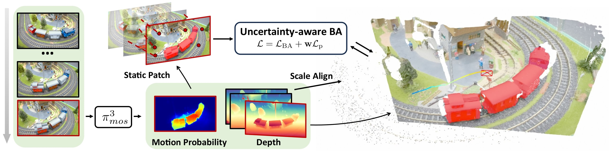
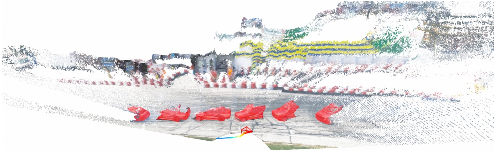

<p align="center">
  <h1 align="center"><em>&pi;³</em><sub>mos</sub>-SLAM: Dynamic Visual SLAM using a General 3D Prior</h1>


  <p align="center">
    <a href="https://github.com/PRBonn/Pi3MOS-SLAM"></a>
    <a href="https://github.com/PRBonn/Pi3MOS-SLAM"></a>
    .svg?style=flat-square" />
    <a href="https://lbesson.mit-license.org/"></a>
  </p>


  <p align="center">
    <a href="https://www.ipb.uni-bonn.de/people/xingguang-zhong/index.html"><strong>Xingguang Zhong</strong></a>
    ·
    <a href="https://www.ipb.uni-bonn.de/people/liren-jin/index.html"><strong>Liren Jin</strong></a>
    ·
    <a href="https://www.tudelft.nl/en/staff/m.popovic/?cHash=07e8a5fb4eda6d511853b2bacaa92260"><strong>Marija Popović</strong></a>
    ·
    <a href="https://www.ipb.uni-bonn.de/people/jens-behley/"><strong>Jens Behley</strong></a>
    ·
    <a href="https://www.ipb.uni-bonn.de/people/cyrill-stachniss/"><strong>Cyrill Stachniss</strong></a>
  </p>
  <h3 align="center"><a href="#">Paper</a> | <a href="#">Video</a></h3>
  <div align="center"></div>




Bonn | WildGS 
:-: | :-: 
<video src='https://github.com/user-attachments/assets/8312aaf8-b530-464a-8b74-cc7c387eef22.mp4'> | <video src='https://github.com/user-attachments/assets/ace5c91d-bb4f-497f-b6e6-bb6daa6851e5.mp4'> |

## TODO List
   - [x] Release the slam code and weights of <em>&pi;³</em><sub>mos</sub>.
   - [x] Evaluation scripts for camera tracking.
   - [ ] Evaluation scripts for moving object segmentation.
   - [ ] Evaluation scripts for video depth prediction.
   - [ ] Training code of <em>&pi;³</em><sub>mos</sub>.

## Installation
We tested the code on Ubuntu 22.04 with Cuda 12.1.

Clone the repo
```
git clone https://github.com/PRBonn/Pi3MOS-SLAM.git --recursive
cd Pi3MOS-SLAM
```
Create and activate the Anaconda environment
```
conda env create -f environment.yml
conda activate pi3mos
```

Download Eigen and install <em>&pi;³</em><sub>mos</sub>-slam
```bash
wget https://gitlab.com/libeigen/eigen/-/archive/3.4.0/eigen-3.4.0.zip
unzip eigen-3.4.0.zip -d thirdparty

# install
pip install . --no-build-isolation
```
Download the weights of DPVO network
```
mkdir checkpoints
bash scripts/download_model.sh
```
Download the weights of <em>&pi;³</em><sub>mos</sub> model [here](https://drive.google.com/file/d/145bC76pMHikhdTGkqDK0t9Ta0R7tw51v/view?usp=drive_link) and copy it into the checkpoints folder.

## Run
Download one demo sequence of [Wild-SLAM Mocap Dataset](https://github.com/GradientSpaces/WildGS-SLAM)
```
bash scripts/download_wild_slam_mocap_umbrella.sh
```
Then run the demo code with:
```
python demo.py --imagedir datasets/Wild_SLAM_Mocap/scene1/umbrella/rgb --calib calib/wildgs/umbrella.txt --viz
```
We downsample the point cloud to reduce the computational burden of visualization. If you run the demo without `--calib`, the code will automatically estimate the intrinsic parameters from <em>&pi;³</em><sub>mos</sub>'s depth prediction.

## Evaluation
For camera tracking performance, we evaluate our method on three datasets: Wild-SLAM Mocap Dataset, Bonn RGB-D Dataset, and Sintel Dataset. 
### Wild-SLAM Mocap Dataset

Download all sequences from the [Wild-SLAM Mocap Dataset](https://github.com/GradientSpaces/WildGS-SLAM). You can use the download scripts from [WildGS-SLAM](https://github.com/GradientSpaces/WildGS-SLAM).
```
bash scripts/download_wild_slam_mocap_scene1.sh
bash scripts/download_wild_slam_mocap_scene2.sh
```
Then run the evaluation with: (change the dataset_root first)
```
python evaluation/evaluate_wild.py --dataset_root /path/to/Wild_SLAM_Mocap
```
### Bonn RGB-D Dataset
Download the data from our [website](https://www.ipb.uni-bonn.de/data/rgbd-dynamic-dataset/index.html) :wink:. To keep consistent with baselines, we only report results on 8 sequences, which you can find in `evaluation/evaluate_bonn.py`. Once the data preparation is done, change the path and run:
```
python evaluation/evaluate_bonn.py --dataset_root /path/to/rgbd_bonn_dataset
```

### Sintel Dataset

Download the data [here](https://drive.google.com/file/d/1bSGX7JY73M3HzMS6xsJizRkPH-NQLPOf/view) (This link is from [MegaSam](https://mega-sam.github.io/)) and unzip it to your desired location, then change the path and run:

```
python evaluation/evaluate_sintel.py --dataset_root /path/to/Sintel
```

We test our code on one Nvidia RTX A6000. Different environments and hardware may lead to slightly different results. We welcome testing and discussions :handshake:.


## Acknowledgements
We built our system upon [<em>&pi;³</em>](https://github.com/yyfz/Pi3) and [DPVO](https://github.com/princeton-vl/DPVO). We thank the authors for open-sourcing such great projects. 

## Contact
If you have any questions, feel free to contact:

- Xingguang Zhong [zhong@igg.uni-bonn.de](mailto:zhong@igg.uni-bonn.de)
- Liren Jin [ljin@uni-bonn.de](mailto:ljin@uni-bonn.de)

## Citation
If you use <em>&pi;³</em><sub>mos</sub>-slam for your academic work, please cite:
```
@article{zhong2025arxiv,
  title   = {{Dynamic Visual SLAM using a General 3D Prior}},
  author  = {Zhong, Xingguang and Jin, Liren and Popovi{\'c}, Marija and Behley, Jens and Stachniss, Cyrill},
  journal = arxiv,
  volume  = {arXiv:2506.00970},
  year    = {2025}
}
```
